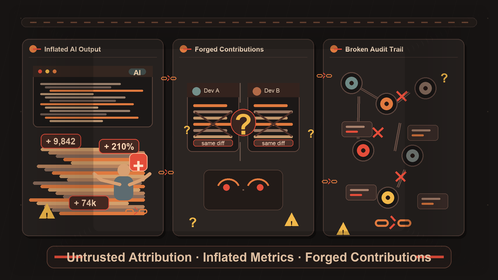
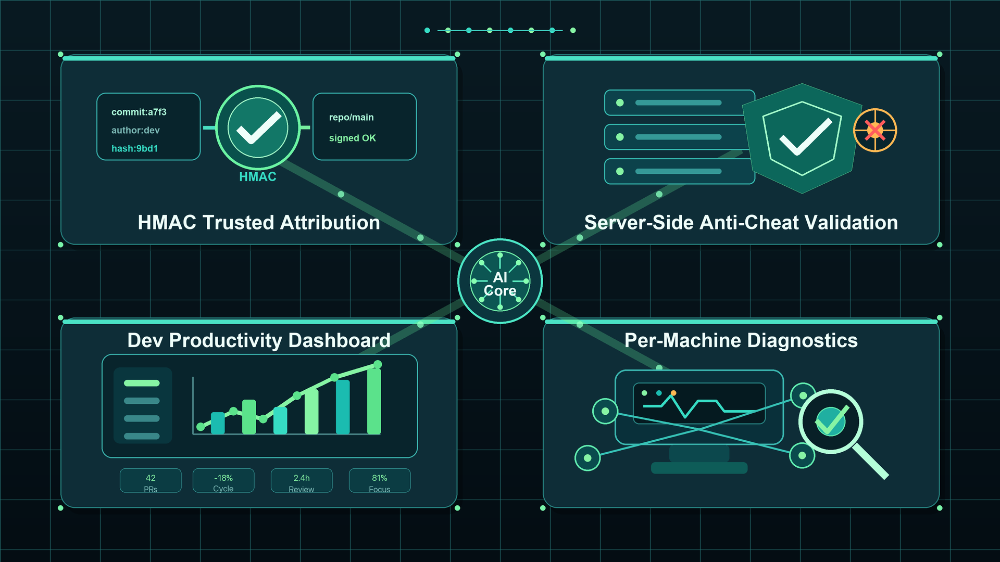
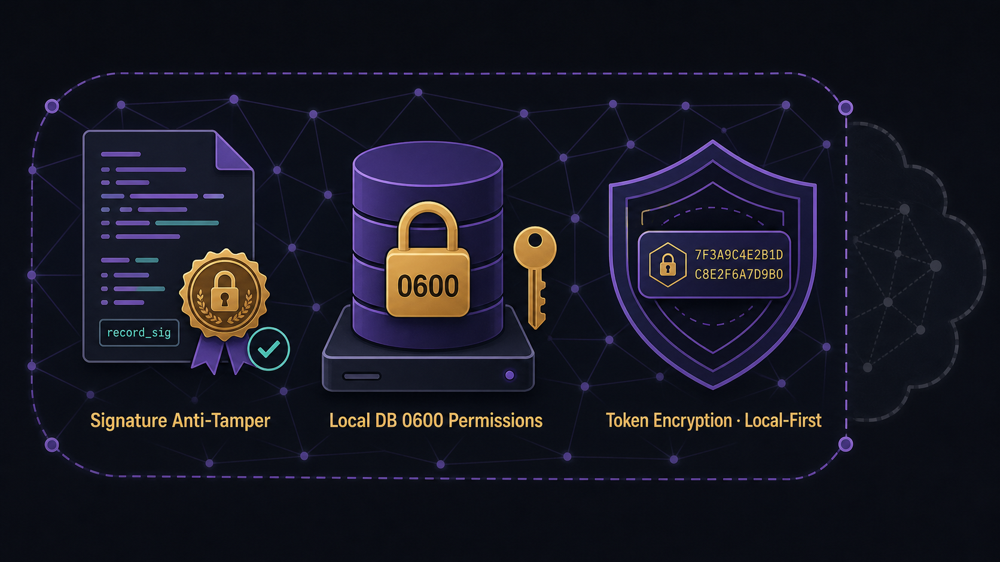

<sub>🌐 <a href="README.md">简体中文</a> · <b>English</b> · <a href="README.ja.md">日本語</a> · <a href="README.ko.md">한국어</a></sub>

<div align="center">

# aitrack 🛡️

> *「Bring AI coding behavior into trusted auditing — give your engineering effectiveness team real data.」*

<a href="https://github.com/MapleEve/company-aitrack/actions/workflows/ci.yml"></a>
<a href="https://codecov.io/gh/MapleEve/company-aitrack"></a>
<a href="https://github.com/MapleEve/company-aitrack/releases"></a>
<a href="LICENSE"></a>
<a href="docs/DEPLOYMENT.md"></a>

<br>
<br>


<br>

aitrack installs lightweight hooks into Claude Code, Codex CLI, and Cursor,<br>generating HMAC-signed records at every edit event,<br>filtering noise and tampering through a 10-step server validation chain,<br>so engineering effectiveness teams get trustworthy, auditable, quantifiable AI usage data.

<br>

[Quick Start](#quick-start) · [Architecture](#architecture) · [Deploy](docs/DEPLOYMENT.md) · [API](docs/API.md) · [Contribute](CONTRIBUTING.md)

</div>

---

## Problem

<p align="center">
  
</p>

AI coding tools (Claude Code, Codex CLI, Cursor) have entered engineering teams at scale, creating three governance challenges that are hard to ignore:

| Pain Point | Reality |
|------------|---------|
| **AI output is hard to attribute reliably** | No native mechanism distinguishes "AI-written" from "human-written" code — reporting tools are meaningless |
| **Line-count metrics are easy to game** | Trivial pastes, redundant completions, and meaningless repetition all inflate line counts far beyond actual contribution |
| **Attribution data can be forged** | Local statistics can be modified before submission — administrators have no way to assess data trustworthiness |

---

## Who It's For

<p align="center">
  
</p>

| Role | Core Need |
|------|-----------|
| **Engineering Effectiveness Teams** | Objectively quantify actual AI tool output, identify low-efficiency usage patterns, support monthly effectiveness reports |
| **Engineering Managers** | Real-time visibility into hook installation status and suspicious data flags — no longer dependent on developer self-reporting |
| **Privacy-conscious · Self-hosting Teams** | All data stays on self-hosted infrastructure, never passes through any third-party cloud service, meeting compliance requirements |

---

## Architecture

aitrack consists of three independent components communicating via Protocol v1.2:

| Component | Stack | Responsibility |
|-----------|-------|----------------|
| **Rust client** `aitrack` | Rust · single binary · no runtime dependencies | Install hooks, capture edit events, HMAC signing, upload data |
| **Java server** `aitrack-server` | Java 17 · Spring Boot 3.3.8 · H2 / PostgreSQL | 10-step validation chain, trusted attribution, effectiveness queries (primary implementation) |
| **Go server** `aitrack-server-go` | Go 1.25 · chi v5.2.5 · SQLite / PostgreSQL | Feature-equivalent lightweight alternative implementation |

**Protocol v1.2 key design:**

- All upload requests include `record_sig` (HMAC-SHA256 covering 11 core fields) and a request-level HMAC signature
- `POST /admin/tokens` returns a single `credential` field (`<token>-<hmac_secret>`), simplifying issuance and client configuration
- `hostname` field (new in v1.1) makes activity from a single token across multiple machines reviewable per device
- Local client database `~/.aitrack/records.db` permissions 0600, `hmac_secret` encrypted with AES-256-GCM at rest

---

## What You Get

<p align="center">
  
</p>

### HMAC Trusted Attribution

Every edit record generates a `record_sig` at local database insert time, covering 11 fields: `token_key`, `device_id`, `hostname`, `timestamp`, `tool`, `file_path`, `repo_url`, `current_sha`, `added_lines`, `removed_lines`, `diff_hunk(SHA-256)`. The server recomputes and compares at step 4 — any tampered field is detected.

### 10-Step Server Validation Chain

| Step | Check | Failure Outcome |
|------|-------|----------------|
| 1 | Bearer token valid and active | `401` |
| 2 | `X-AiTrack-Timestamp` within ±300s (replay prevention) | `401` |
| 3 | `X-AiTrack-Signature` request HMAC matches | `401` |
| 4 | `record_sig` matches per edit | `rejected: sig_mismatch` |
| 5 | `diff_hunk` line counts consistent with `added_lines`/`removed_lines` (±1) | `flagged: diff_inconsistent` |
| 6 | `repo_url` in whitelist (configurable) | `flagged/rejected: repo_unknown` |
| 7 | `file_path` plausibility check | `flagged: path_mismatch` |
| 8 | `added_lines ≤ 5000` | `flagged: oversized` |
| 9 | Rate limit: ≤ 30 edits per (token, file_path) per hour | `rejected: rate_limited` |
| 10 | Persist (accepted + flagged edits) | — |

### Engineering Effectiveness Metrics

Query aggregated stats by developer, repository, or device via `GET /api/v1/ai-track/stats?group_by=token|repo|device` to support effectiveness reports.

### Per-hostname Manual Review

`GET /api/v1/ai-track/devices` shows each device's heartbeat status and hook installation state. When a hook is silently removed, the next execution of any `aitrack` command automatically reports the anomalous state — administrators can follow up proactively.

---

## Quick Start

### 1. Start the Server

```bash
# Generate keys
export AITRACK_SECRET_KEY=$(openssl rand -base64 32)
export AITRACK_ADMIN_KEY=$(openssl rand -hex 32)

# Build and start (H2 embedded database, suitable for quick evaluation)
docker-compose up -d --build

# Verify service
curl http://localhost:8080/actuator/health
```

### 2. Issue a Credential

```bash
curl -X POST http://localhost:8080/admin/tokens \
  -H "X-Admin-Key: $AITRACK_ADMIN_KEY" \
  -H 'Content-Type: application/json' \
  -d '{"owner":"alice","note":"macbook"}'
# Returns credential and token_key — credential shown only once, store securely
```

### 3. Developer-side Hook Installation

```bash
# Build the client
cd client && cargo build --release
# Or extract binary from distribution package to /usr/local/bin/

# Install Claude Code hook
aitrack init --claude \
  --api-url https://aitrack.example.com \
  --credential <credential>

# Check status
aitrack status

# View local records (latest 20)
aitrack inspect --limit 20
```

### 4. View Team Data

Once developers have data flowing, administrators can query team usage and device status:

```bash
TOKEN="aitrack_abcdef1234567890abcdef1234567890"  # replace with the token issued in step 2

# Aggregated effectiveness data by developer (token) — primary entry for monthly reports
curl -s "http://localhost:8080/api/v1/ai-track/stats?group_by=token" \
  -H "Authorization: Bearer $TOKEN"

# All device heartbeats and hook installation status — investigate hook anomalies
curl -s "http://localhost:8080/api/v1/ai-track/devices" \
  -H "Authorization: Bearer $TOKEN"
```

`group_by` also accepts `repo` (by repository), `device` (by device UUID), and `hostname` (by machine name). See [docs/API.md](docs/API.md) for full details.

### 5. Coverage Verification (Docker)

```bash
# Client (Rust, coverage threshold 90%)
docker build -f docker/Dockerfile.client -t aitrack-client:latest .

# Java server (JaCoCo LINE >= 90%)
docker build -f docker/Dockerfile.server-java -t aitrack-server-java:latest .

# Go server (go tool cover >= 90%)
docker build -f docker/Dockerfile.server-go -t aitrack-server-go:latest .

# E2E (one round each for Java + Go)
bash e2e/run.sh both
```

---

## Security & Privacy

<p align="center">
  
</p>

| Mechanism | Description |
|-----------|-------------|
| **record_sig tamper prevention** | HMAC-SHA256 covers 11 core fields, signed at local database insert, verified per-record by the server |
| **Local database 0600** | `~/.aitrack/config.toml` and `records.db` permissions are 0600, preventing reads by other users on the same machine |
| **Token AES encryption** | `hmac_secret` stored server-side with AES-256-GCM encryption, requires `AITRACK_SECRET_KEY` |
| **Token hash storage** | Server stores only `sha256(token)` — plaintext returned only once at issuance |
| **Local-first** | All data stored on self-hosted infrastructure, never passes through any third-party cloud service |
| **Constant-time comparison** | HMAC verification uses constant-time comparison to prevent timing attacks |
| **Minimal collection** | Collects file paths, change diffs (unified diff format, changed lines only — not full file content), line counts, and repo metadata; does not collect prompt content, conversation history, or keyboard input |

---

## Documentation

| Document | Description |
|----------|-------------|
| [CONTRACT.md](CONTRACT.md) | Client/server protocol contract (endpoints, field definitions, signing spec, hook templates) |
| [docs/ARCHITECTURE.md](docs/ARCHITECTURE.md) | System architecture design (component diagram, data flow, deployment topology) |
| [docs/API.md](docs/API.md) | API reference (all endpoints, request/response structures) |
| [docs/DEPLOYMENT.md](docs/DEPLOYMENT.md) | Deployment guide (Docker, PostgreSQL migration, production configuration) |
| [docs/DEVELOPMENT.md](docs/DEVELOPMENT.md) | Developer guide (local build, module structure, contribution workflow) |
| [docs/SECURITY_MODEL.md](docs/SECURITY_MODEL.md) | Security model (threat modeling, HMAC spec, defense layers) |
| [docs/TESTING.md](docs/TESTING.md) | Testing system (three-tier architecture, factory pattern, coverage thresholds, Docker verification) |
| [CHANGELOG.md](CHANGELOG.md) | Version changelog |
| [CONTRIBUTING.md](CONTRIBUTING.md) | Contribution guide (commit conventions, PR process, testing requirements) |
| [SECURITY.md](SECURITY.md) | Security vulnerability reporting process |

---

## Star History

[](https://www.star-history.com/#MapleEve/company-aitrack&type=date)

---

## Acknowledgements

[](https://linux.do)

Thanks to the **`linux.do`** community for discussions, sharing, and support. This project's engineering practices, design thinking, and continuous iteration have all benefited from the community atmosphere and member exchanges.

---

[MIT License](LICENSE) © 2026 MapleEve
