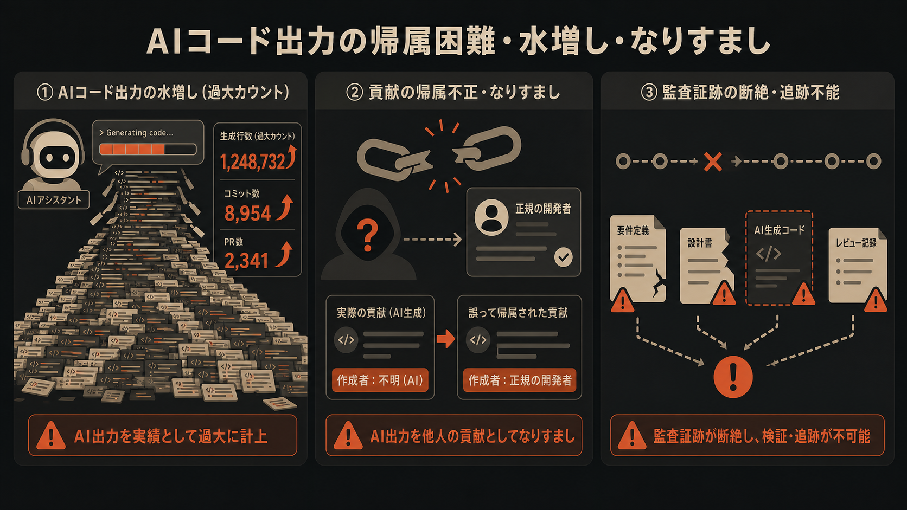
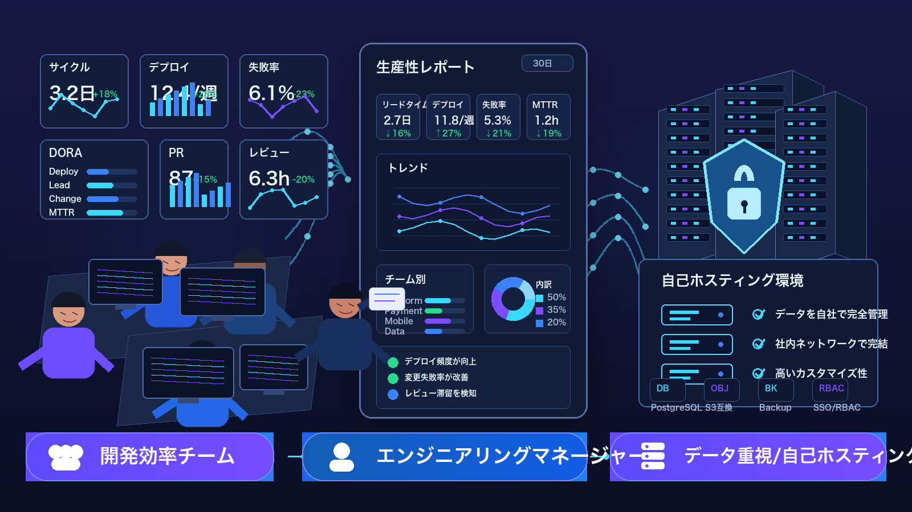
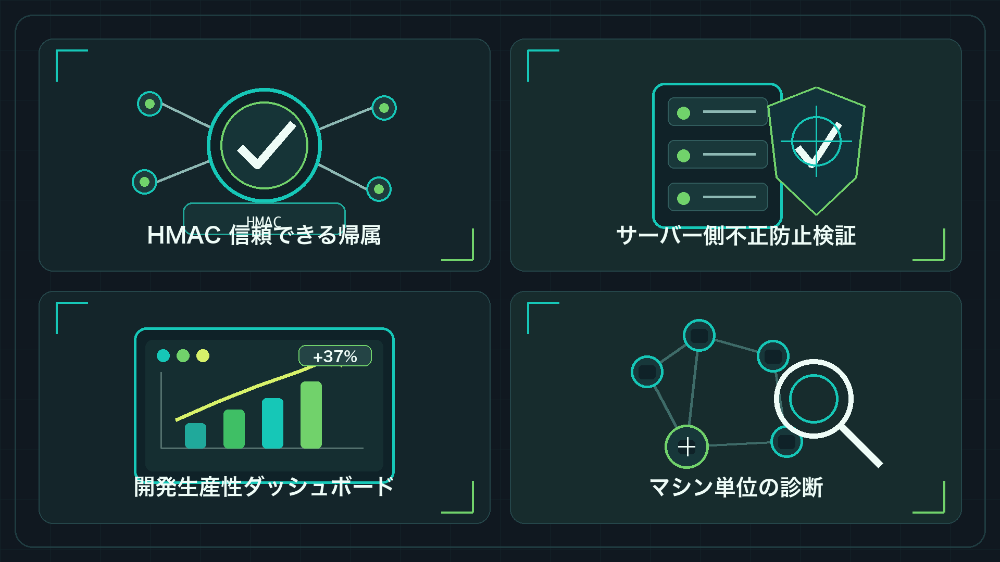
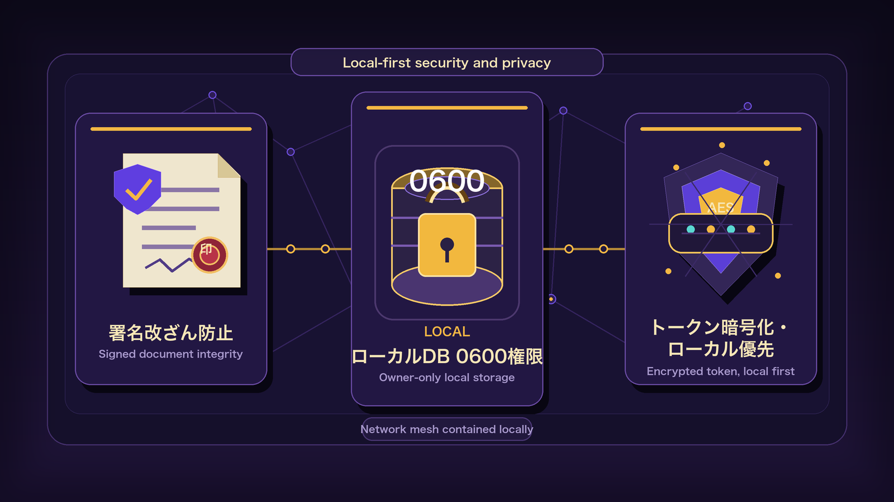

# company-aitrack

[](https://github.com/MapleEve/company-aitrack/actions)
[](https://codecov.io/gh/MapleEve/company-aitrack)
[](https://github.com/MapleEve/company-aitrack/releases)
[](LICENSE)
[](docs/DEPLOYMENT.md)

[简体中文](README.md) | [English](README.en.md) | [日本語](README.ja.md) | [한국어](README.ko.md)

---


---

## 課題



AI コーディングツール（Claude Code、Codex CLI、Cursor）が開発チームに大規模導入される中、避けられない3つのガバナンス課題が生じています：

| 課題 | 現状 |
|------|------|
| **AI の成果を信頼できる形で帰属できない** | 「AI が書いたコード」と「人が書いたコード」を区別するネイティブな仕組みがなく、統計ツールが形骸化している |
| **行数指標が水増しされやすい** | 単純な貼り付け・無意味な繰り返し・冗長な補完で行数が嵩み、実際の貢献と乖離する |
| **帰属データが改ざんされる可能性がある** | ローカルの統計データは送信前に自由に変更可能で、管理者はデータの信頼性を判断できない |

---

## 対象ユーザー



| ロール | 主要なニーズ |
|--------|-------------|
| **エンジニアリング効率チーム** | AI ツールの実際の産出物を客観的に定量化し、低効率な使用パターンを特定して月次効率レポートをサポート |
| **エンジニアリングマネージャー** | フックのインストール状態と疑わしいデータフラグをリアルタイムで把握し、開発者の自己申告に依存しない |
| **データセキュリティ重視・セルフホスティングチーム** | すべてのデータが自社ホスティングのインフラに留まり、サードパーティのクラウドサービスを一切経由しないため、コンプライアンス要件を満たす |

---

## アーキテクチャ

aitrack はプロトコル v1.1 で通信する3つの独立したコンポーネントで構成されています：

| コンポーネント | スタック | 役割 |
|--------------|---------|------|
| **Rust クライアント** `aitrack` | Rust · シングルバイナリ · ランタイム依存なし | フックのインストール、編集イベントのキャプチャ、HMAC 署名、データのアップロード |
| **Java サーバー** `aitrack-server` | Java 17 · Spring Boot 3.2.x · H2 / PostgreSQL | 10ステップ検証チェーン、信頼できる帰属、効率クエリ（主要実装） |
| **Go サーバー** `aitrack-server-go` | Go 1.22 · chi v5 · SQLite | Java と機能同等の軽量代替実装 |

**プロトコル v1.1 の主要設計：**

- すべてのアップロードリクエストには `record_sig`（11のコアフィールドをカバーする HMAC-SHA256）とリクエストレベルの HMAC 署名が含まれる
- `hostname` フィールド（v1.1 で新規追加）により、1つのトークンを複数マシンで使用した場合にデバイス次元での手動レビューが可能
- クライアントのローカルデータベース `~/.aitrack/records.db` のパーミッションは 0600、`hmac_secret` は AES-256-GCM で暗号化して保存

---

## 得られるもの



### HMAC による信頼できる帰属

各編集レコードはローカルDBへの書き込み時に `record_sig` を生成します。カバーするフィールドは `token_key`、`device_id`、`hostname`、`timestamp`、`tool`、`file_path`、`repo_url`、`current_sha`、`added_lines`、`removed_lines`、`diff_hunk(SHA-256)` の11フィールドです。サーバーはステップ4で再計算して比較し、いずれかのフィールドが改ざんされていれば検出されます。

### 10ステップサーバー検証チェーン

| ステップ | チェック内容 | 失敗時の結果 |
|---------|------------|------------|
| 1 | Bearer トークンが有効 | `401` |
| 2 | `X-AiTrack-Timestamp` が ±300秒以内（リプレイ防止） | `401` |
| 3 | `X-AiTrack-Signature` リクエスト HMAC が一致 | `401` |
| 4 | `record_sig` が各編集で一致 | `rejected: sig_mismatch` |
| 5 | `diff_hunk` の行数が `added_lines`/`removed_lines` と一致（±1） | `flagged: diff_inconsistent` |
| 6 | `repo_url` がホワイトリスト内（設定可能） | `flagged/rejected: repo_unknown` |
| 7 | `file_path` の妥当性チェック | `flagged: path_mismatch` |
| 8 | `added_lines ≤ 5000` | `flagged: oversized` |
| 9 | レート制限：（token, file_path）ごとに1時間あたり ≤ 30件 | `rejected: rate_limited` |
| 10 | 永続化（承認済み + フラグ付き編集） | — |

### エンジニアリング効率の計測

`GET /api/v1/ai-track/stats?group_by=token|repo|device` で開発者・リポジトリ・デバイス次元の集計統計を取得し、効率レポートをサポートします。

### hostname 次元での手動調査

`GET /api/v1/ai-track/devices` で各デバイスのハートビート状態とフックインストール状況を確認できます。フックがサイレントに削除された場合、次の `aitrack` コマンド実行時に異常状態が自動的に報告され、管理者が能動的にフォローアップできます。

---

## クイックスタート

### 1. サーバーの起動

```bash
# キーの生成
export AITRACK_SECRET_KEY=$(openssl rand -base64 32)
export AITRACK_ADMIN_KEY=$(openssl rand -hex 32)

# ビルドと起動（H2 組み込みデータベース、クイック評価に適切）
docker-compose up -d --build

# サービスの確認
curl http://localhost:8080/actuator/health
```

### 2. クレデンシャルの発行

```bash
curl -X POST http://localhost:8080/admin/tokens \
  -H "X-Admin-Key: $AITRACK_ADMIN_KEY" \
  -H 'Content-Type: application/json' \
  -d '{"owner":"alice","note":"macbook"}'
# credential と token_key が返される — credential は一度のみ表示、安全に保管すること
```

### 3. 開発者側のフックインストール

```bash
# クライアントのビルド
cd client && cargo build --release
# または配布パッケージからバイナリを /usr/local/bin/ に展開

# Claude Code フックのインストール
aitrack init --claude \
  --api-url https://aitrack.example.com \
  --credential <credential>

# ステータスの確認
aitrack status

# ローカルレコードの表示（最新20件）
aitrack inspect --limit 20
```

### 4. チームデータの確認

開発者側からデータが上報されたら、管理者は以下のコマンドでチームの実際の利用状況とデバイス状態を確認できます：

```bash
TOKEN="aitrack_abcdef1234567890abcdef1234567890"  # ステップ2で発行したトークンに置き換える

# 開発者（token）次元の集計効率データを確認 — 月次レポートの入口
curl -s "http://localhost:8080/api/v1/ai-track/stats?group_by=token" \
  -H "Authorization: Bearer $TOKEN"

# 全デバイスのハートビートとフックインストール状態を確認 — フック異常の調査
curl -s "http://localhost:8080/api/v1/ai-track/devices" \
  -H "Authorization: Bearer $TOKEN"
```

`group_by` には `repo`（リポジトリ別）、`device`（デバイス UUID 別）、`hostname`（マシン名別）も指定できます。詳細は [docs/API.md](docs/API.md) を参照してください。

### 5. カバレッジ検証（Docker）

```bash
# クライアント（Rust、カバレッジ閾値 90%）
docker build -f docker/Dockerfile.client -t aitrack-client:latest .

# Java サーバー（JaCoCo LINE >= 90%）
docker build -f docker/Dockerfile.server-java -t aitrack-server-java:latest .

# Go サーバー（go tool cover >= 90%）
docker build -f docker/Dockerfile.server-go -t aitrack-server-go:latest .

# E2E（Java + Go それぞれ1ラウンド）
bash e2e/run.sh both
```

---

## セキュリティとプライバシー



| 仕組み | 説明 |
|--------|------|
| **record_sig による改ざん防止** | HMAC-SHA256 が11のコアフィールドをカバーし、ローカルDB書き込み時に署名、サーバーが各レコードを検証 |
| **ローカルDB 0600** | `~/.aitrack/config.toml` と `records.db` のパーミッションは 0600、同一マシンの他ユーザーによる読み取りを防止 |
| **トークン AES 暗号化** | `hmac_secret` はサーバー側で AES-256-GCM 暗号化して保存、`AITRACK_SECRET_KEY` の設定が必要 |
| **トークンハッシュ保存** | サーバーは `sha256(token)` のみを保存 — 平文は発行時に一度のみ返される |
| **ローカルファースト** | すべてのデータがセルフホスティングインフラに保存され、サードパーティのクラウドサービスを一切経由しない |
| **定数時間比較** | HMAC 検証はタイミング攻撃を防ぐために定数時間比較を使用 |
| **最小限の収集** | ファイルパス、diff、行数、リポジトリのメタデータのみを収集 — コード内容、会話、キーボード入力は収集しない |

---

## ドキュメント

| ドキュメント | 説明 |
|------------|------|
| [CONTRACT.md](CONTRACT.md) | クライアント/サーバープロトコル契約（エンドポイント、フィールド定義、署名仕様、フックテンプレート） |
| [docs/ARCHITECTURE.md](docs/ARCHITECTURE.md) | システムアーキテクチャ設計（コンポーネント図、データフロー、デプロイトポロジー） |
| [docs/API.md](docs/API.md) | API リファレンス（全エンドポイント、リクエスト/レスポンス構造） |
| [docs/DEPLOYMENT.md](docs/DEPLOYMENT.md) | デプロイガイド（Docker、PostgreSQL 移行、本番設定） |
| [docs/DEVELOPMENT.md](docs/DEVELOPMENT.md) | 開発者ガイド（ローカルビルド、モジュール構造、コントリビューションフロー） |
| [docs/SECURITY_MODEL.md](docs/SECURITY_MODEL.md) | セキュリティモデル（脅威モデリング、HMAC 仕様、防御レイヤー） |
| [TESTING.md](TESTING.md) | テストシステム（三層アーキテクチャ、ファクトリーパターン、カバレッジ閾値、Docker 検証） |
| [CHANGELOG.md](CHANGELOG.md) | バージョン変更履歴 |
| [CONTRIBUTING.md](CONTRIBUTING.md) | コントリビューションガイド（コミット規則、PR プロセス、テスト要件） |
| [SECURITY.md](SECURITY.md) | セキュリティ脆弱性報告プロセス |

---

## License


[MIT License](LICENSE) © 2026 MapleEve
