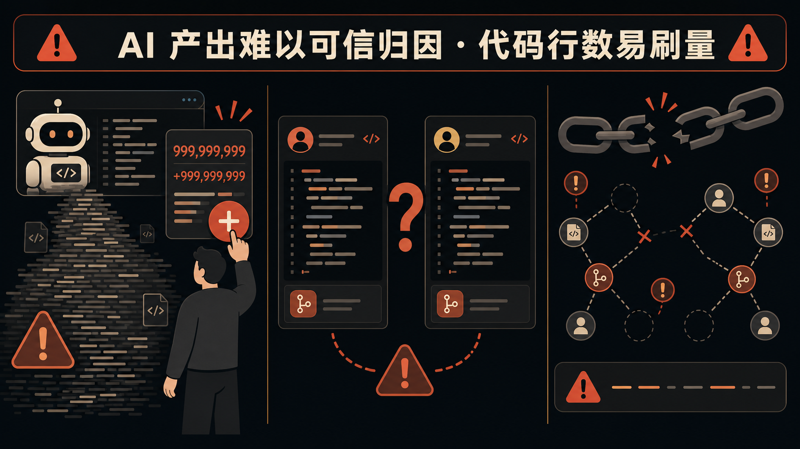
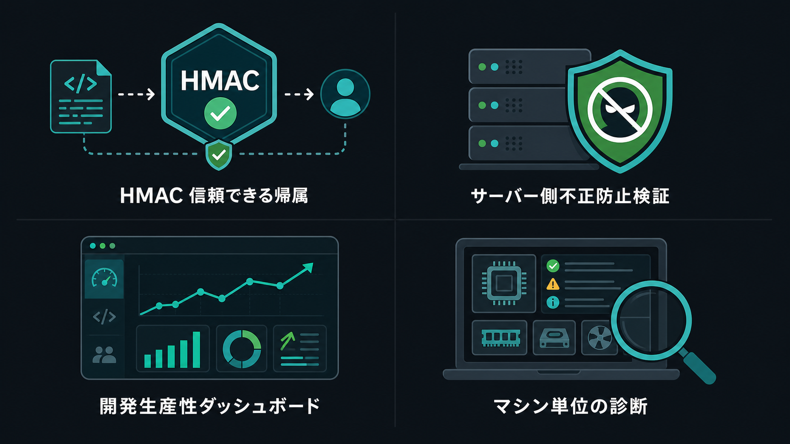
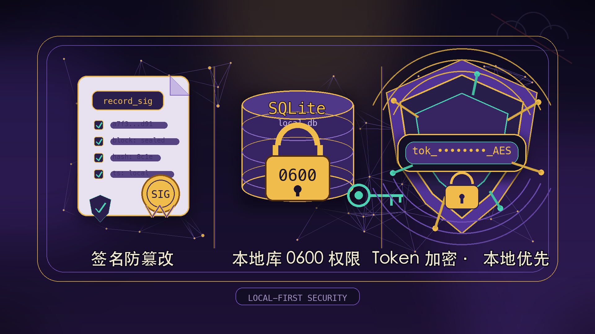

# company-aitrack

[](https://github.com/MapleEve/company-aitrack/actions)
[](https://codecov.io/gh/MapleEve/company-aitrack)
[](https://github.com/MapleEve/company-aitrack/releases)
[](LICENSE)
[](docs/DEPLOYMENT.md)

[简体中文](README.md) | [English](README.en.md) | [日本語](README.ja.md) | [한국어](README.ko.md)

---


---

## 问题



AI 编码工具（Claude Code、Codex CLI、Cursor）大规模进入研发团队，带来了三个难以回避的治理挑战：

| 痛点 | 现状 |
|------|------|
| **AI 产出难可信归因** | 没有原生机制区分"AI 写的"与"人工写的"，统计工具形同虚设 |
| **行数指标易灌水** | 简单粘贴、无意义重复、补全冗余均可刷高行数，与实际贡献脱节 |
| **归属数据可伪造** | 本地统计在上报前可被任意修改，管理员无法判断数据可信度 |

---

## 适合谁


| 角色 | 核心需求 |
|------|----------|
| **研发效能团队** | 客观量化 AI 工具实际产出，识别低效使用模式，支撑效能月报 |
| **工程效能管理者** | 实时感知钩子安装状态、可疑数据标记，避免被动依赖开发者自报告 |
| **数据敏感·自托管团队** | 所有数据留存于自建服务，不经过任何第三方云服务，满足合规要求 |

---

## 架构

aitrack 由三个独立组件构成，通过协议 v1.1 互通：

| 组件 | 技术栈 | 职责 |
|------|--------|------|
| **Rust 客户端** `aitrack` | Rust · single binary · 无运行时依赖 | 安装钩子、捕获编辑事件、HMAC 签名、上报数据 |
| **Java 服务端** `aitrack-server` | Java 17 · Spring Boot 3.2.x · H2 / PostgreSQL | 10 步校验链、可信归因、效能查询（主推实现） |
| **Go 服务端** `aitrack-server-go` | Go 1.22 · chi v5 · SQLite | 与 Java 端功能对等的轻量备选实现 |

**协议 v1.1 关键设计：**

- 所有上报请求均附带 `record_sig`（HMAC-SHA256 覆盖 11 个核心字段）和请求级 HMAC 签名
- `hostname` 字段（v1.1 新增）使同一 token 在多台机器上的活动可按设备维度人工审查
- 客户端本地数据库 `~/.aitrack/records.db` 权限 0600，`hmac_secret` AES-256-GCM 加密存储

---

## 你会得到什么



### HMAC 可信归因

每条编辑记录在本地落库时即生成 `record_sig`，覆盖 `token_key`、`device_id`、`hostname`、`timestamp`、`tool`、`file_path`、`repo_url`、`current_sha`、`added_lines`、`removed_lines`、`diff_hunk(SHA-256)` 共 11 个字段。服务端在步骤 4 重新计算并对比，任何字段被篡改均会被检出。

### 10 步服务端校验链

| 步骤 | 检查内容 | 失败结果 |
|------|----------|----------|
| 1 | Bearer token 有效 | `401` |
| 2 | `X-AiTrack-Timestamp` 在 ±300s 内（防重放） | `401` |
| 3 | `X-AiTrack-Signature` 请求 HMAC 匹配 | `401` |
| 4 | `record_sig` 逐条匹配 | `rejected: sig_mismatch` |
| 5 | `diff_hunk` 行数与 `added_lines`/`removed_lines` 一致（±1） | `flagged: diff_inconsistent` |
| 6 | `repo_url` 在白名单内（可配置） | `flagged/rejected: repo_unknown` |
| 7 | `file_path` 合理性校验 | `flagged: path_mismatch` |
| 8 | `added_lines ≤ 5000` | `flagged: oversized` |
| 9 | 限流：每（token, file_path）每小时 ≤ 30 条 | `rejected: rate_limited` |
| 10 | 持久化（已接受 + 已标记） | — |

### 研发效能度量

通过 `GET /api/v1/ai-track/stats?group_by=token|repo|device` 按开发者、仓库或设备维度聚合统计，支撑效能报告。

### 按 hostname 维度人工排查

`GET /api/v1/ai-track/devices` 展示每台设备的心跳状态与钩子安装情况。钩子被静默移除时，下次任意命令执行后心跳自动上报异常状态，管理员可主动跟进。

---

## 快速开始

### 1. 启动服务端

```bash
# 生成密钥
export AITRACK_SECRET_KEY=$(openssl rand -base64 32)
export AITRACK_ADMIN_KEY=$(openssl rand -hex 32)

# 构建并启动（H2 嵌入式数据库，适合快速体验）
docker-compose up -d --build

# 验证服务
curl http://localhost:8080/actuator/health
```

### 2. 签发 token

```bash
curl -X POST http://localhost:8080/admin/tokens \
  -H "X-Admin-Key: $AITRACK_ADMIN_KEY" \
  -H 'Content-Type: application/json' \
  -d '{"owner":"alice","note":"macbook"}'
# 返回 token 和 hmac_secret，仅显示一次，请妥善保存
```

### 3. 开发者侧安装钩子

```bash
# 构建客户端
cd client && cargo build --release
# 或从分发包解压二进制到 /usr/local/bin/

# 安装 Claude Code 钩子
aitrack init --claude \
  --api-url https://aitrack.example.com \
  --api-token <token> \
  --hmac-secret <hmac_secret>

# 验证状态
aitrack status

# 查看本地记录（最近 20 条）
aitrack inspect --limit 20
```

### 4. 查看团队数据

开发者侧有数据上报后，管理员可通过以下命令查看团队实际用量与设备状态：

```bash
TOKEN="aitrack_abcdef1234567890abcdef1234567890"  # 替换为步骤 2 签发的 token

# 按开发者（token）维度查看汇总效能数据 — 效能月报入口
curl -s "http://localhost:8080/api/v1/ai-track/stats?group_by=token" \
  -H "Authorization: Bearer $TOKEN"

# 查看所有设备心跳与钩子安装状态 — 排查钩子异常
curl -s "http://localhost:8080/api/v1/ai-track/devices" \
  -H "Authorization: Bearer $TOKEN"
```

`group_by` 还支持 `repo`（按仓库）、`device`（按设备 UUID）、`hostname`（按机器名）。详见 [docs/API.md](docs/API.md)。

### 5. 覆盖率验证（Docker）

```bash
# 客户端（Rust，覆盖率门槛 90%）
docker build -f docker/Dockerfile.client -t aitrack-client:latest .

# Java 服务端（JaCoCo LINE ≥ 90%）
docker build -f docker/Dockerfile.server-java -t aitrack-server-java:latest .

# Go 服务端（go tool cover ≥ 90%）
docker build -f docker/Dockerfile.server-go -t aitrack-server-go:latest .

# E2E（Java + Go 各一轮）
bash e2e/run.sh both
```

---

## 安全与隐私



| 机制 | 说明 |
|------|------|
| **record_sig 防篡改** | HMAC-SHA256 覆盖 11 个核心字段，本地落库即签名，服务端逐条核验 |
| **本地库 0600** | `~/.aitrack/config.toml` 和 `records.db` 权限均为 0600，防止同机其他用户读取 |
| **token AES 加密** | `hmac_secret` 在服务端以 AES-256-GCM 加密存储，需设置 `AITRACK_SECRET_KEY` |
| **token 哈希存储** | 服务端仅存储 `sha256(token)`，明文仅签发时返回一次 |
| **本地优先** | 所有数据存储于自建服务，不经过任何第三方云服务 |
| **常量时间比较** | HMAC 验证使用常量时间比较，防止 timing attack |
| **最小采集** | 仅采集文件路径、diff、行数、repo 元数据，不收集代码内容、对话或键盘输入 |

---

## 文档

| 文档 | 说明 |
|------|------|
| [CONTRACT.md](CONTRACT.md) | 客户端/服务端协议契约（端点、字段定义、签名规范、钩子模板） |
| [docs/ARCHITECTURE.md](docs/ARCHITECTURE.md) | 系统架构设计（组件图、数据流、部署拓扑） |
| [docs/API.md](docs/API.md) | API 参考（所有端点、请求/响应结构） |
| [docs/DEPLOYMENT.md](docs/DEPLOYMENT.md) | 部署指南（Docker、PostgreSQL 切换、生产配置） |
| [docs/DEVELOPMENT.md](docs/DEVELOPMENT.md) | 开发者指南（本地构建、模块结构、贡献流程） |
| [docs/SECURITY_MODEL.md](docs/SECURITY_MODEL.md) | 安全模型（威胁建模、HMAC 规范、防御层次） |
| [TESTING.md](TESTING.md) | 测试体系（三层架构、工厂模式、覆盖率门槛、Docker 验证） |
| [CHANGELOG.md](CHANGELOG.md) | 版本变更记录 |
| [CONTRIBUTING.md](CONTRIBUTING.md) | 贡献指南（提交规范、PR 流程、测试要求） |
| [SECURITY.md](SECURITY.md) | 安全漏洞报告流程 |

---

## License


[MIT License](LICENSE) © 2026 MapleEve
